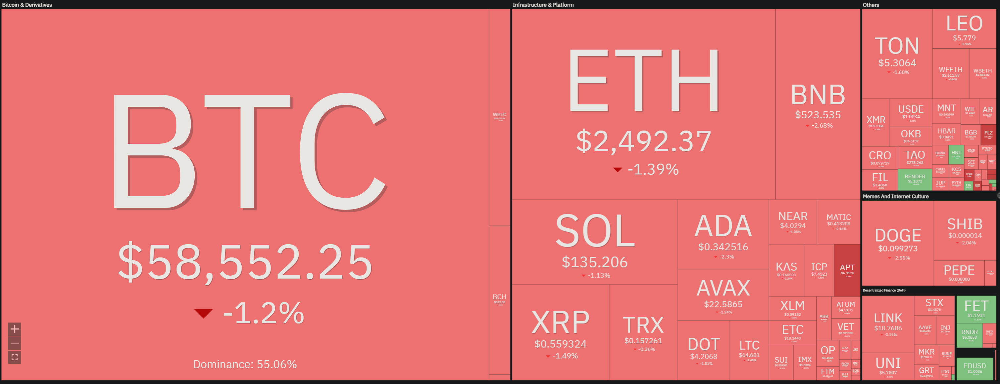

# Cryptocurrency Treemap 📊

This is a simple cryptocurrency treemap that shows the market capitalization of the top 100 cryptocurrencies. The data is fetched from the [coin360](https://coin360.com/)'s API and the treemap is created using Plotly.

<p align="center">
  
  
  <a href="https://github.com/psf/black"></a>
</p>

---

## Introduction

This is a very common visualization often used for the stock market, especially for the [S&P 500](https://github.com/StephanAkkerman/spy-heatmap). The treemap gives you a quick overview of the performance of the top 100 cryptocurrencies. The size of the boxes represents the market capitalization of the cryptocurrency and the color represents the 24-hour change.

## Installation ⚙️

The required packages to run this code can be found in the requirements.txt file. To run this file, execute the following code block after cloning the repository:

```bash
pip install -r requirements.txt
```

## Usage ⌨️

To generate the chart, simply run the script using the following command:

```bash
python src/main.py
```

## Example 📊

The following chart is an example of the output generated by the script.


### References 📚

The following image was used as a reference to create the crypto treemap.


## Other Projects 📦

This project is part of a series of projects that I have created. You can find the other projects in the following list:

- [Total Liquidation Chart](https://github.com/StephanAkkerman/liquidations-chart)
- [Bitcoin Rainbow Chart](https://github.com/StephanAkkerman/bitcoin-rainbow-chart)
- [Live Binance Charts](https://github.com/StephanAkkerman/live-binance-charts)
- [RSI Heatmap](https://github.com/StephanAkkerman/crypto-rsi-heatmap)
- [Funding Rate Heatmap](https://github.com/StephanAkkerman/funding-rate-heatmap)
- [S&P 500 Heatmap](https://github.com/StephanAkkerman/spy-heatmap)
